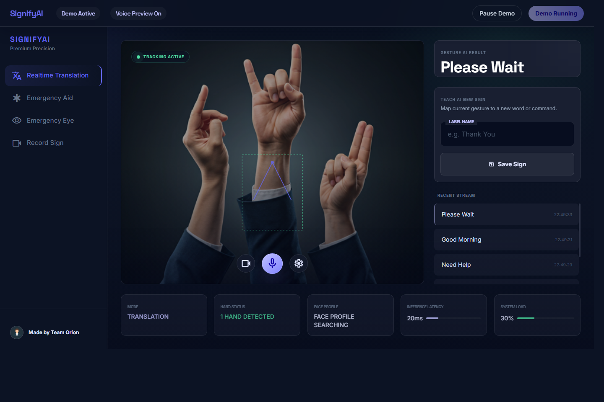

# 🤟 SignifyAI | Real-Time Assistive Sign Language & Eye Communication Platform

> **Adaptive, Real-Time Hand Gesture & Eye Landmark Detection with Live Runtime Sign Teaching, Anti-Flicker Stability Guards, Text-to-Speech Output, and Web Bridge API Deployment.**


---

## 📌 Executive Overview

**SignifyAI** is an emergency-first, patient-focused assistive communication platform engineered for live medical scenarios, accessibility care, and real-time demonstrations. It translates hand signs and eye gestures into spoken audio and text in real time using webcam inputs.

Unlike rigid static gesture classifiers that break when presented with new signs or variable lighting, **SignifyAI is adaptive and live-trainable**:
- **Live Runtime Teaching**: Users can record and activate new emergency hand signs live during a session without restarting or performing lengthy ML retraining.
- **Dual Emergency Modes**: Dedicated **Hand Emergency Assist (`aid`)** mode and hands-free **Eye Assist (`eye`)** mode for paralyzed or mobility-impaired patients.
- **Anti-Flicker Stability Engine**: Implements temporal sliding window majority voting, confidence thresholding, and spatial location-aware priors to eliminate false label spikes.

---

## 🎯 Key Features & Technical Highlights

```
┌───────────────────┐     ┌───────────────────┐     ┌─────────────────────┐
│ 1. Frame Capture  │ ──> │ 2. Landmark       │ ──> │ 3. Adaptive         │
│    (Cam / Web)    │     │    Extraction     │     │    Prototype Match  │
└───────────────────┘     └───────────────────┘     └─────────────────────┘
                                                               │
                                                               ▼
┌───────────────────┐     ┌───────────────────┐     ┌─────────────────────┐
│ 6. Text-to-Speech │ <── │ 5. Anti-Flicker   │ <── │ 4. Spatial Location │
│    Audio Output   │     │    Stability Vote │     │    Aware Priors     │
└───────────────────┘     └───────────────────┘     └─────────────────────┘
```

### ⚡ 1. Live Runtime Sign Teaching
- **Zero-Downtime Custom Signs**: Record a new custom gesture live in runtime; SignifyAI extracts hand vectors and immediately activates the sign as a reusable prototype stored in `data/models/sign_prototypes.json`.
- **Instant Recognition**: Newly taught signs are instantly recognized alongside pre-configured emergency gestures.

---

### 👁️ 2. Dual Emergency Communication Modes
- **Hand Emergency Mode (`aid`)**: Fast, rule-augmented emergency gesture detection designed for urgent distress calls (*"Help"*, *"Pain"*, *"Water"*, *"Doctor"*).
- **Eye Assist Mode (`eye`)**: A hands-free fallback mode tracking eye landmarks (blinks, gaze holds, duration detection) for patients with severe motor restrictions.
- **Sign Management Console**: Manage, preview, and prune custom taught prototypes.

---

### 🛡️ 3. Anti-Flicker & Location-Aware Stability Engine
- **Temporal Voting Filter (`stability.py`)**: Sliding-window majority voting eliminates rapid label jumping and single-frame noise.
- **Spatial Location Priors**: Uses spatial positioning (head vs. face vs. chest coordinates) to separate visually similar handshapes.
- **Confidence Guarding**: Filters out low-confidence predictions to prevent erroneous speech outputs.

---

### 🔊 4. Asynchronous Text-to-Speech (TTS)
- **Non-Blocking Audio Engine**: Threaded TTS manager (`speech_engine.py`) using Windows SAPI with pyttsx3 fallback.
- **Smart Cooldown & Deduplication**: Prevents repetitive audio stuttering while prioritizing urgent emergency alerts.

---

### 🌐 5. Web Bridge API & Cloud Browser Support
- **FastAPI Web Bridge (`src/web_bridge.py`)**: Connects desktop python backends with browser frontend interfaces.
- **Dual Camera Pipeline**: Supports both local server webcams and browser webcam frame streaming via `/api/frame/upload`.
- **Cloud Deploy Ready**: Includes ready-to-use deployment manifests for **Render** (`render.yaml`), **Railway** (`railway.json`), and **Docker** (`Dockerfile`).

---

## 📸 Visual Tour & User Interface

| Real-Time Landmark Tracking & Sign Recognition | Live Emergency Hand Mode (`aid`) |
| :---: | :---: |
|  |  |

| Live Runtime Sign Teaching Interface | Adaptive Prototype Matching & Detection |
| :---: | :---: |
|  |  |

| Hands-Free Eye Assist Mode (`eye`) | Multi-Hand Gesture Stability Analysis |
| :---: | :---: |
|  |  |

| Custom Taught Signs Manager | Web UI Desktop Interface |
| :---: | :---: |
|  |  |

---

## 🏗️ Architecture & Codebase Map

```text
d:\SignifyAI\
├── src/
│   ├── main.py                     # Entry point, CLI dispatcher & interactive menu
│   ├── web_bridge.py               # FastAPI backend bridge for web/browser clients
│   ├── core/
│   │   ├── hand_detection.py       # MediaPipe landmark extraction & camera stream
│   │   ├── speech_engine.py        # Asynchronous multi-threaded TTS speaker
│   │   └── stability.py            # Temporal sliding-window anti-flicker filter
│   ├── modes/
│   │   ├── realtime_translator.py  # Live runner engine, overlay rendering & speech gating
│   │   ├── emergency_mode.py       # Emergency rule-based decoder (`aid`)
│   │   └── demo_mode.py            # Hardcoded demo gesture decoder
│   ├── dataset/
│   │   ├── recording.py            # Live clip recording & landmark vectorization
│   │   └── dataset_builder.py      # Manifest creation & split health checks
│   └── model/
│       ├── sequence_model.py       # ML classifier training (SVC, KNN, Random Forest, MLP)
│       └── model_manager.py        # Model registry & active version promotion
├── data/
│   ├── models/                     # Trained artifacts & sign_prototypes.json
│   └── landmarks/                  # Raw recorded clip manifests
├── ui/                             # Web frontend interface files
├── Dockerfile                      # Single-container build config
├── render.yaml                     # Render service deploy spec
├── railway.json                    # Railway deployment config
├── requirements.txt                # Python dependencies
└── README.md                       # Comprehensive documentation
```

---

## 💻 Tech Stack

- **Computer Vision**: OpenCV, Google MediaPipe Hand Landmarker.
- **Machine Learning**: Scikit-Learn (Support Vector Classifier, KNN, Random Forest, MLP Classifier), NumPy.
- **Audio & TTS**: SAPI (Windows Native), Pyttsx3.
- **Backend API**: FastAPI, Uvicorn, SSE (Server-Sent Events).
- **Deployment**: Docker, Render, Railway.

---

## 🛠️ Quick Setup & Running Locally

### 1. Create Virtual Environment
```bash
# Clone repository
git clone https://github.com/proxy-cmd/SignifyAI.git
cd SignifyAI

# Create virtual environment
python -m venv .venv

# Activate virtual environment
# Windows PowerShell:
.\.venv\Scripts\Activate.ps1
# Windows CMD:
.venv\Scripts\activate.bat
```

### 2. Install Dependencies
```bash
python -m pip install -r requirements.txt
```

### 3. Run SignifyAI
```bash
# Launch interactive menu
python -u src/main.py

# Run directly in Emergency Hand Mode (`aid`)
python -u src/main.py run --mode aid

# Run directly in Eye Assist Mode (`eye`)
python -u src/main.py run --mode eye
```

---

## 🌐 Deploying Web Backend (Free-Tier Friendly)

Deploy the web backend bridge (`src/web_bridge.py`) to Render or Railway for hosted web access:

### Option A: Deploy on Render
1. Push repository to GitHub.
2. In [Render](https://render.com), create a new **Web Service** selecting this repository.
3. Render automatically reads `render.yaml` and builds the service.
4. Verify backend health check: `https://<your-service>.onrender.com/api/health`.

### Option B: Deploy on Railway
1. In [Railway](https://railway.app), create a new project from your GitHub repository.
2. Railway detects `railway.json` and `Dockerfile`.
3. Verify backend health check: `https://<your-service>.up.railway.app/api/health`.

### Connect Web Frontend to Hosted Backend
Update `ui/bridge-port.json`:
```json
{
  "baseUrl": "https://<your-hosted-backend-domain>"
}
```

---

## 🧪 Running Automated Tests

Validate core system stability and dataset builder modules:

```bash
python -m pytest -q
```

---

## 📜 License

Distributed under the **MIT License**. See `LICENSE` for details.

---
*Built with ❤️ for accessible healthcare, emergency communication, and assistive technologies.*
